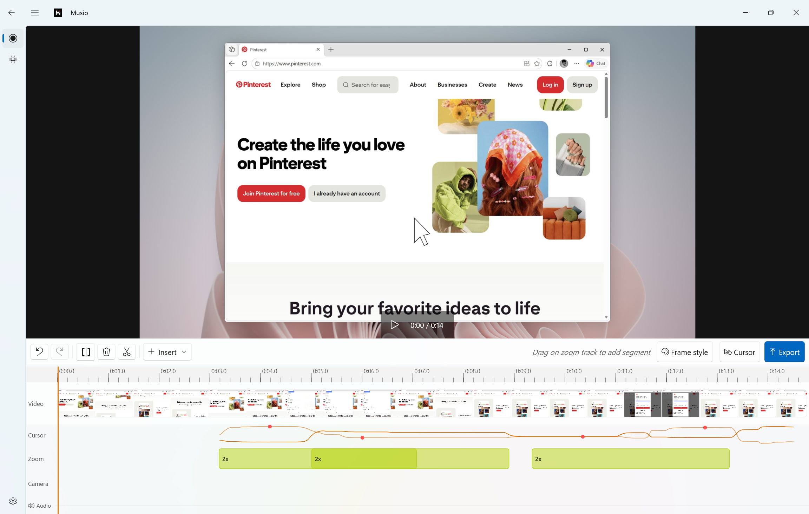

# Mixtri

**Professional screen recording with cinematic cursor effects for Windows.**

Mixtri is a screen recorder and editor optimized to run natively on Windows. Record your screen, add beautiful effects, and export polished videos — all from a native Windows app.

> **Formerly Musio.** The app was renamed to Mixtri; it is the same project, and the Store listing
> updates in place. Projects saved as `.musio` still open — Mixtri saves new ones as `.mixtri`.



## Features

- **Screen capture** — Record full screen, a single window, or a custom region at 30 or 60 fps
- **Cinematic cursor effects** — Automatic zoom-to-click, smooth cursor trails, and highlight animations
- **Timeline editor** — Trim, split, and adjust speed with a visual timeline and instant preview
- **Automatic typing pace** — Sustained text-entry bursts are accelerated to 1.5×, muted, and framed with a subtle caret-focused zoom (or a broad click-position fallback for custom text controls)
- **Segment transitions** — Configurable dissolve, wipe, slide, push, and stylized effects at any timeline cut
- **Beautiful backgrounds** — Gradient, image, and wallpaper backgrounds behind your recording
- **Webcam overlay** — Picture-in-picture webcam feed with shape and position controls
- **Flexible export** — Export to MP4, GIF, or WebM in resolutions up to 4K with preset management

## Prerequisites

| Tool | Version |
|------|---------|
| .NET SDK | 9.0+ |
| Windows 10 SDK | 10.0.26100.0+ |
| Visual Studio | 2022 17.8+ with **.NET desktop development** and **Windows App SDK** workloads |

## Build & Run

The simplest route is to open `Mixtri.sln` in Visual Studio and press **F5**.

From the command line, build with **Visual Studio MSBuild**:

```powershell
# Clone the repo
git clone https://github.com/pratikmistri/mixtri.git
cd mixtri

# Locate VS MSBuild
$msbuild = & "${env:ProgramFiles(x86)}\Microsoft Visual Studio\Installer\vswhere.exe" `
    -latest -products * -find "MSBuild\**\Bin\MSBuild.exe" | Select-Object -First 1

# Build (always pass /restore; a bare /t:Build fails to restore after a clean)
& $msbuild src\Mixtri.App\Mixtri.App.csproj /restore /t:Build /p:Configuration=Debug /p:Platform=x64
```

> **`dotnet build` does not work on this repo.** It fails in the WinUI resource (PriGen) tooling
> with `MSB4062`, as does `dotnet test` when it tries to build. Use VS MSBuild as above. The app
> is packaged (MSIX), so `dotnet run` is not the launch path either — run it from Visual Studio,
> or register the build output with
> `Add-AppxPackage -Register <bin>\AppxManifest.xml`.

## Tests

Build the test project with MSBuild first, then run it without rebuilding:

```powershell
& $msbuild src\Mixtri.Tests\Mixtri.Tests.csproj /restore /t:Build /p:Configuration=Debug /p:Platform=x64
dotnet test src\Mixtri.Tests\Mixtri.Tests.csproj --no-build -p:Platform=x64 -c Debug
```

If the host lacks the exact .NET 9 runtime, set `DOTNET_ROLL_FORWARD=Major` before `dotnet test`.

## Architecture

```
mixtri/
├── src/
│   ├── Mixtri.App/         # WinUI 3 front-end (XAML pages, view models, controls)
│   │   ├── Pages/          # RecordingPage, EditorPage, ExportPage, SettingsPage
│   │   ├── Controls/       # PreviewCanvas, TimelineControl, RegionSelector
│   │   ├── ViewModels/     # MVVM view models (CommunityToolkit.Mvvm)
│   │   ├── Helpers/        # DialogHelper and UI utilities
│   │   └── Services/       # App-level services
│   ├── Mixtri.Core/        # Platform-independent capture & editing engine
│   └── Mixtri.Tests/       # MSTest suite covering Mixtri.Core
├── docs/                   # Documentation and assets
├── learnings/              # Settled playbooks and the historical decision archive
└── Mixtri.sln              # Solution file
```

## License

This project is licensed under the Apache License, Version 2.0 — see the [LICENSE](LICENSE) file
for details.

If you redistribute Mixtri or a derivative work, the license requires you to retain copyright and
attribution notices and to include the attribution from the [NOTICE](NOTICE) file in your
redistribution (e.g., in a NOTICE file, documentation, or a credits screen). Please keep the
credit visible in your product's about/credits screen or documentation.

Releases published before this change remain available under the MIT License.
